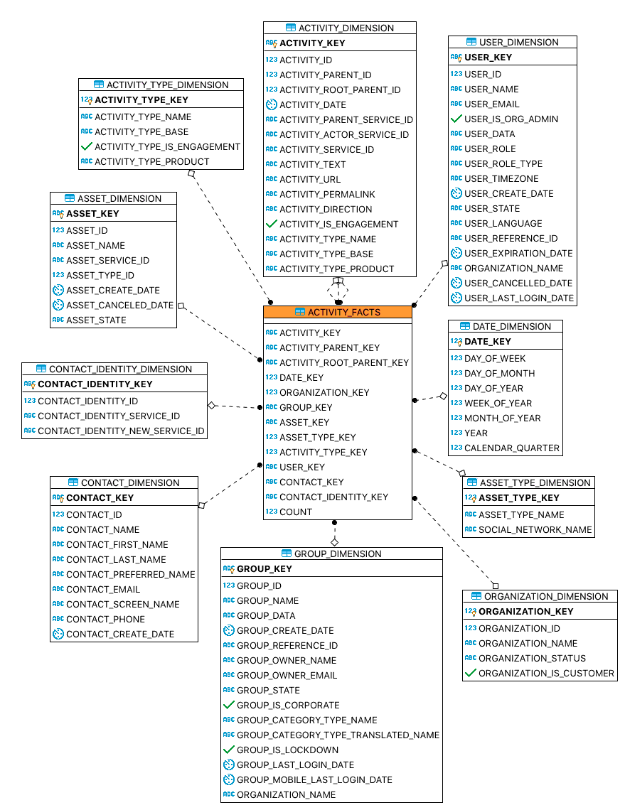

## Overview

The Activity Facts table describes a single action by either a Hearsay user or another person interacting with a Hearsay user. Examples of activities are posting to a social network, sending a private message, or someone liking a social media post.

## Fact Table

### Activity_Facts

| Name | Type | Description |  
|:---------|:---------|:---------|  
| Activity_Key | String | Primary Key |
| Activity_Parent_Key | String | Parent Key |

### Dimension Tables

### Activity_Dimension

**Description**
The **Activity_Dimension** table contains the properties related to an activity. An Activity is a single action by either a Hearsay user, or another person interacting with a Hearsay user. Examples include: posting to a social network, sending a private message, or someone liking a social media post. 

| Name | Type | Description |  
|:---------|:---------|:---------|  
| Activity_ID |Integer |Unique identifier of this activity in Hearsay Social. |
| Activity_Parent_ID | Integer" |The ID of a related activity message. Specified if this activity has a relation to another, such as a comment on a post or a reply to a message. |
| Activity_Service_ID | String | An ID representing where this action occurred. For example, the unique Facebook ID for a\ncomment on Facebook. |
| Activity_Text | String | Text associated with the activity for example, a social media posting or text message. | 
| Activity_Direction | String | Indicates whether the activity was inbound to a Hearsay user or outbound from a Hearsay user. |
| Activity_Permalink | String | A link to the social media content. |
| Activity_Is_Engagement | Boolean | Indicates whether the activity has been read or a user has responded to it. |
| Activity_Type_Name | String | Specifies the activity's type. |
| Activity_Type_Product | String | The type of asset or account, this activity is from. |

**Remainder of document not displayed**