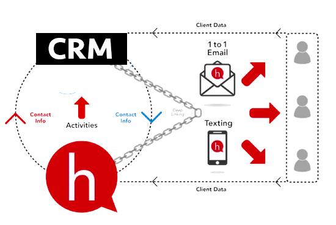
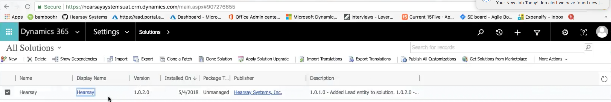
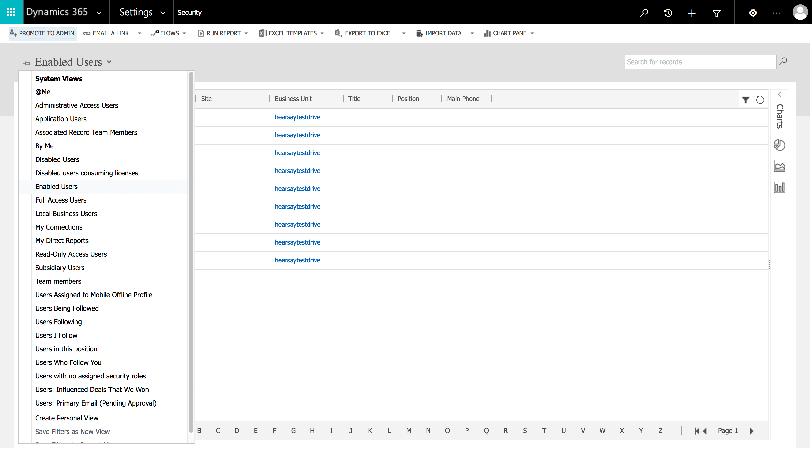
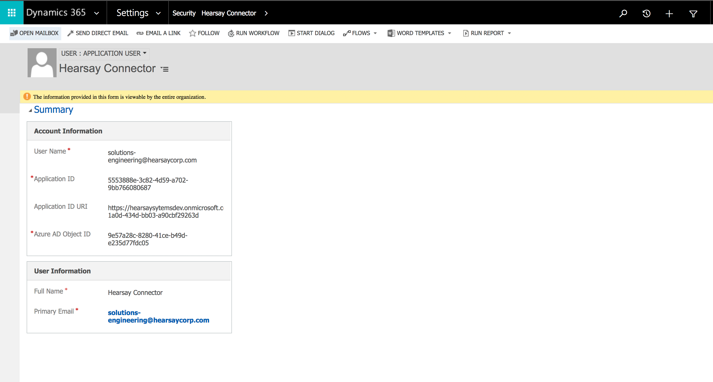
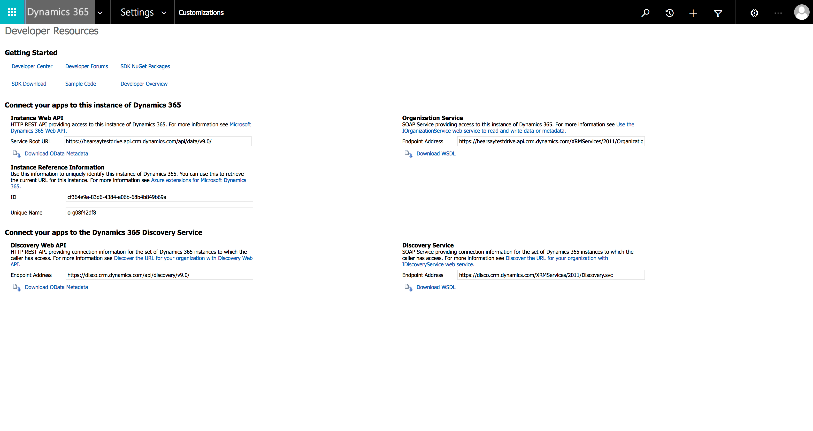

# Microsoft Dynamics 365 Integration

## Overview

This section describes the onboarding process to enable customers to use the Hearsay Dynamics 365 Connector. Before this process can be attempted the Dynamics 365 Connector must be installed. If you have not received an installation packet from Hearsay, contact your account manager to arrange for the delivery of one. 

---

## Prerequisites

• Hearsay Managed Solution Packet  
• [Microsoft Dynamics 365](https://dynamics.microsoft.com/en-us/?&OCID=AID720979_SEM_WtytagvD&utm_source=Google&utm_medium=CPC&utm_term=microsoft%20dynamics%20365&utm_campaign=Dynamics&lnkd=Google_D365_Brand&gclid=Cj0KCQiAvqDiBRDAARIsADWh5Tetf-blkVt2_nAMkqbKBMqNEjt1skz98yHE3Q7aWuVevR74XaCI7xAaAtm1EALw_wcB)

---

##Integration Process

### Import The Hearsay Managed Solution into Microsoft Dynamics 365

To begin the onboarding process, import the Hearsay Managed Solution packet that was provided to you by Hearsay. This will be an archived (.zip) file. 

1. In Microsoft Dynamics 365, under the **All Solutions** tab, click on the **Import** button. 

2. A selector panel will appear, navigate to the location where the archived managed solution packet provided by Hearsay was stored and select it. 
3. An installation panel will appear, proceed through the installation process by clicking the **Next** button on each screen until the file import process begins. Thre is no need to change any of the settings.

### Authorize The Dynamics 365 Connector

Once the Hearsay supplied managed solution has been imported, Microsoft Dynamics 365 will need to be given authorization to access your Hearsay data. The context is that you give authorization to the connector to access dynamics and in that dynamics data.

When the Hearsay Dynamics 365 Connector was purchased/registered a confirmation email was provided. Within that email an authorization link was also provided. Click that link to authorize Microsoft 365 Dynamics to access the Hearsay data. 

### Create Hearsay Dynamics 365 Connector User

1. In the Microsoft Dynamics 365 top bar click on the **Sections** dropdown and select **Settings**. 
2. In the **System** grouping select **Security**
3. From the **Security** screen, select **Users**
4. From the **Users** screen, click the down arrow next to **Enabled Users** and select **Application Users** from the list of options.

5. A **User Summary**  panel will display. Enter a username. 

6. The **Application ID** will be the same application number provided in the authorization link. 
7. **Application ID URI** and **Azure AD Object iD** will be pre-populated for you. 
8. In the second row at the top of the screen click on **Manage Roles**.
9. In the panel that appears, scroll to the **Hearsay Data Connector** role and select it. 

### Provide Organization ID, Unique Name and URL To Hearsay

In order to complete the provisioning process, Hearsay will need summary information about their Dynamics 365 Connector installation. The user must provide an **Organization ID**, a **Unique Name**, and an **Organization URL**. This information can be obtained from Microsoft Dynamics 365 using the following process and subsequently sent to Hearsay: 

1. Click **Settings**.
2. In the  **Customization** grouping, select **Customizations**.
3. From the **Customizations** screen, select **Developer Resources**.
4. From the **Developer Resources** screen, in the **Instance Web API** section, copy the URL provided in the** Service Root URL** setting.
5. From the same screen, in the **Instance Reference Information** section, copy the **ID** and **Unique Name**. 

---
