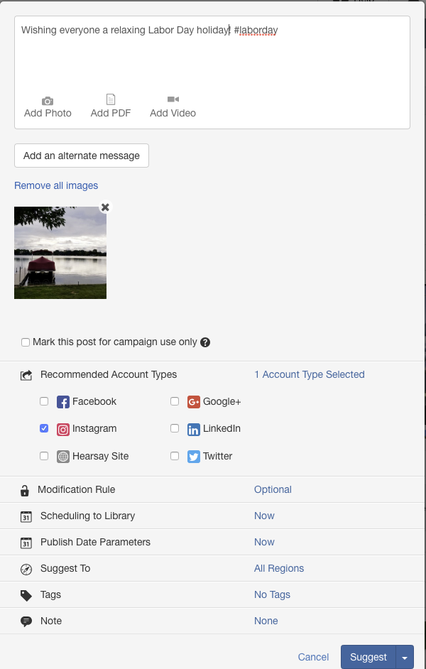
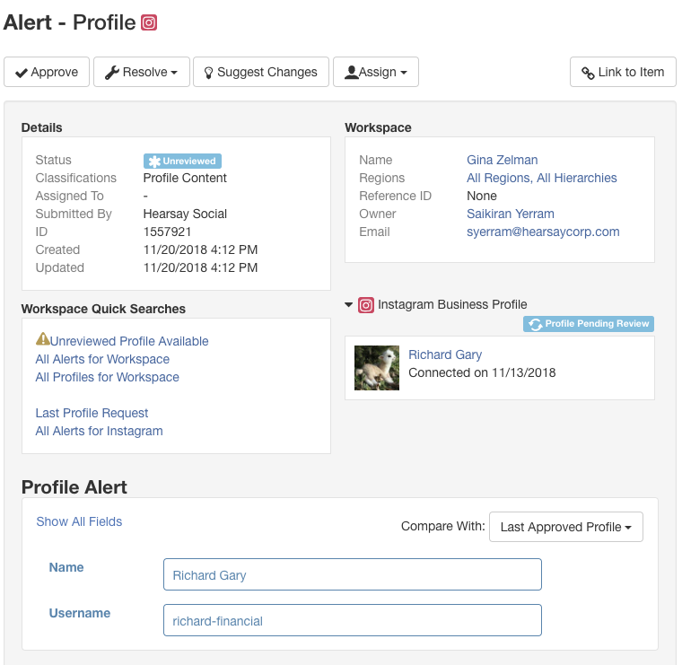
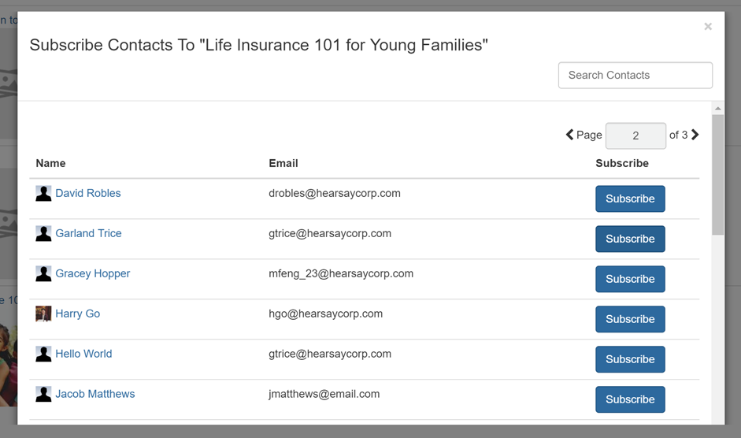
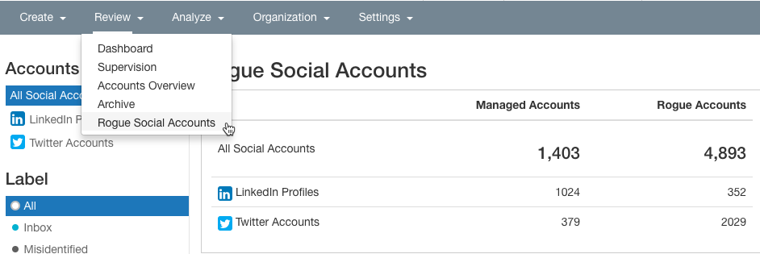
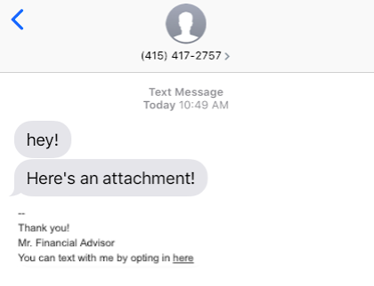

We are excited to announce Hearsay’s first product release of 2019! Our January 22nd release includes, as always, new features and functionality to help your advisors and agents efficiently attract prospects, retain clients, and grow business. 

# January 2019 Release Notes

## Overview of January Product Release:
The release includes brand new updates to the Hearsay Platform, as well as an entirely new network for your field to engage clients and prospects on Hearsay Social. Here is a quick look at what’s new:

## Hearsay Social:
- **Social: Instagram**: Hearsay Social now fully supports Instagram with **Native Compliance**, **Campaigns**, and **Dashboards & Reporting**. This release ties together all features required for admins to launch Instagram in their programs.  
- **Social: PDF Capture of 3rd Party Links (Beta)**: Hearsay Social now makes it easier for compliance and program admins to meet regulatory guidelines with **PDF Capture of 3rd Party Links**.  When advisors and agents include a link within their social posts, this feature crawls and captures via PDF the linked content to send to your archive.

---

## Hearsay Platform:
- **Help Center Refresh**: As we evolve our offering, we want to provide users with comprehensive, on-demand resources for all our communication channels. We’ve updated the design of the **Hearsay Help Center** for an improved user experience, added our technical documentation portal, and made it easier to contact our support team as questions arise.  
- **Contacts Refresh**: We're refreshing our **Contacts** experience across the Hearsay Platform. This update makes it easier than ever to add, edit and manage contacts in **Social**, **1-to-1 Outreach and Relate. **
- **Insights - Download Dashboards**: With Insights, Hearsay’s new reporting and analytics experience, admins can now download a dashboard as a **PDF** or **CSV** file.     
Below you will find much more detailed information about each of these new product features. We look forward to hearing from you as soon as we get these exciting new capabilities in your hands. Please let your **Customer Success Manager** know about your experiences with the new release. We are very excited about this release and what our new process will unlock as we kick off a new year of product releases!  

---

## Social: Instagram, Phase II

**Area**: Social

**Release Date**: December 3, 2018

**Who is impacted**: **Hearsay Social** admins preparing to activate Instagram

**Action Required**: Contact your **CSM** for access

**Archiving / Compliance**: Yes on publishing and profiles

 
### What is Instagram Phase I?
Publishing to **Instagram** is one of our top requested features and we are excited to offer direct publishing to **Instagram Business Profiles**. With this new integration, you can now reach over 1 billion Instagram users in the US and across the globe.

Here is what this release includes:

- **Account Connection**: Ability for users to connect an **Instagram Business Profile** to **Hearsay**.  
- **Profile Management & Supervision**: Ability for admins to approve/suggest/deny profile content. Ability for advisors to manage their profile in Hearsay.  
- **Publishing & Supervision**: Users will be able to publish single photos either from the content library or as original content. These posts will be supervised and sent to your archive based on your org settings.

### Connect an Instagram Business Profile to Hearsay
Connecting an Instagram Business Profile in Hearsay is no different than connecting any other social network.

1. You must have an Instagram **Business Profile** set up to publish to **Instagram**. For more details on how to set up a business profile, please follow this link: https://help.instagram.com/502981923235522?helpref=search&sr=3&query=business.  
2. Go to workspace settings and click on **Connect Instagram**. Follow the on-screen instructions to connect your **Instagram Business Profile**. Once finished, you should see your account listed on the **Accounts** page.

### Suggest and Publish Posts to Instagram
Suggest Instagram Content

As an admin, you can suggest posts to Instagram just as you would with other social networks. We recommend you create new content for Instagram and keep the posts separate from other social networks. Instagram is an image-first social network, and requires images in specific aspect ratios.

1. Click on **New Library Post** and select **Instagram** from the selected network list. 
2. Upload an **Instagram**-compatible photo and optionally add a message. Feel free to use hashtags and mentions.  
3. Add your regions, tags and other metadata information and then click **Suggest**. That's it! Advisors will now be able to publish to **Instagram** from the **Content Library**.

        
#### Photo restrictions for Instagram

1. Only single photos can be published to Instagram.
2. Photos should be under 8MB size and between 150x150 and 1920x1080 pixels.  
3. Photo aspect ratio should be between 4:5 and 1.91:1 range. For best viewing quality, we recommend you choose between 3 options a) Square - 1:1 ratio b) Portrait - 4:5 ratio c) Landscape - 1.91:1.

#### Publish to Instagram

 

**Advisors** can publish, schedule or request approval of a single photo post to Instagram. The same photo rules apply. 

**Supervision** - Approval request of a single photo post to Instagram 

#### Publishing to Instagram from the Mobile App

We are excited to offer Instagram inside the **Hearsay Social Mobile App**. The app offers suggested content as well as the ability to post original content (for which it is uniquely suited). We recommend you promote the **Hearsay Social Mobile App** to your advisors once you are ready to launch Instagram in your program.

In the **Mobile App**, Advisors will be able to:

1. Publish, schedule or request approval of a single photo post to Instagram.  
2. Upload and crop images using preset sizes - Square, Portrait and Landscape for the best viewing quality.  
3. Search for Instagram posts in the library.

Please note that the cropping feature is only available in the **Mobile App**.

### Supervision
Admins will be able to supervise requests for profile approvals and alerts on native profile changes. However due to limitations with the **Instagram API**, Hearsay will not be able auto upload profiles to **Instagram**.

> **Note:** Due to the auto-upload limitation, we will be unable to monitor profile pictures.

### Setup profile fields for Instagram

### Alerts On Native Profile Changes

### Profile Approval Request

### How do you enable Instagram?
Our goal with this **Instagram Phase I** release is to enable you to test the feature, create documentation, and prepare your advisor rollout in Q1 2019. Contact your **Customer Success Manager** or [support](support@hearsaysocial.com) with any additional questions or feedback. .

---

## Social: Action List - Subscribe to Campaigns

**Area**: Social

**Release Date**: December 3, 2018

**Impacted Users**: Advisors and agents using Hearsay Social

**Action Required**: None

**Archiving/Compliance**: None

### Subscribe to Campaigns from the Action List
In addition to the **Campaign Email**, **Hearsay** will now promote new campaigns to your advisors through the **Action List**. This will help you increase your campaign subscription rates, and make it easy for your advisors to find and activate new campaigns.

#### How does it work?

- Once you create a campaign, Hearsay will display it on the **Action List** the day the campaign becomes public.  
- It will display an upcoming post and a **CTA** to “subscribe” to the campaign.  
- Once subscribed, the campaign will be removed from the user's **Action List**.

**Note**: The **Action List** is limited to 3 campaigns. More campaigns will be visible once existing campaigns are expired or the user subscribes.

#### How do you enable this feature?
This will be enabled for organizations that use Hearsay’s new Campaigns and the Action List. If you are not on new Campaigns or do not have the Action List, please contact your CSME.

#### What is included/excluded?
This feature is available on Desktop only. Support for the Mobile App is on our roadmap for 1H 2019.
 
### FAQs:
Q: Will this support both Relative and Dynamic Campaigns?

> A: Yes.

Q: Users have the option to choose a start date for Relative Campaigns in campaigns home page. But I don't see that in the Action List?

> A: The Action List is meant to be simple and remove any friction from subscribing. For Relative Campaigns, we will default the start date to the date of subscription.

Q: What is the order if a workspace has multiple campaigns?

> A: Campaigns will be sorted in reverse chronological order of their date of creation, which usually is the campaign release date.

 
### Screenshots
 
#### Campaign action card view - Desktop

#### Full Desktop view

---

## Social: 1-to-1 Outreach - Onboarding Improvements

**Area**: Social

**Release Date**: December 3, 2018

**Impacted Users**: Admins and **Advisors on 1-to-1 Outreach** (desktop)

**Action Required**: Admin review of **Hearsay** email templates

**Archiving/Compliance**: None

 

### What is 1-to-1 Outreach Onboarding?
**1-to-1 Outreach Onboarding** educates users about the benefits of relationship-oriented client outreach. Onboarding includes three steps that guide users through the setup process and allows them to learn about and test the main features of **1-to-1 Outreach**.

1. Email Setup and Verification
2. Email Signature Setup 
3. Sending First Email(s)

### Step 1: Email Setup and Verification

Users new to **1-to-1 Outreach** will see a landing page that describes and demos in a 2-minute video how to use **1-to-1 Outreach**.

To help users setup their account, Hearsay will pre-fill users’ reply-to email address and email display name according to their Hearsay information. Users can make modifications to this information, or simply click **Start Now** to proceed.

Users will be sent a verification email to verify that they have access to the email inbox they have elected to ensure that they receive email replies.

*To proceed to the next step, users must click the verification link in the email that they receive.*

Users can also resend the verification email, or go back and change their reply-to email address or display name.

### Step 2: Email Signature Setup

Once users have verified their reply-to email address, they will be directed to Step 2 to add an email signature.

This text box accepts simple rich text formatting as shown. Email signatures append to the bottom of all **Hearsay** outbound emails.

While **Hearsay** provides a sample signature, we encourage that you train users on your organization’s email signature policy or recommend that they copy and paste their existing signature from **Outlook** or **Lotus Notes**.

Users can skip this step for now. They can complete or modify their signature via the **Workspace Settings > Email Settings** page at any time.

### Step 3: Sending First Email(s)

Users are prompted to add up to 10 contacts to send their first email. These contacts will be saved in **Hearsay** for future use.

To encourage users to enter contacts, we allow them to select from email templates across three topic areas that have tested well with our advisor base - *Ask for Referral*, *Great Meeting You*, and *Client Appreciation*.

Users cannot modify these templates. These are **Hearsay’s** default email templates and the messaging can be updated by your organization (see enablement section below).

If users wish to skip adding contacts, they can select **Skip** and we will send users an email to show them what it looks like.

  * Users who **Send Email** or **Skip** will see a congratulations pop-up and land in the **1-to-1 Outreach** home page to do further exploration.

### Permalink

We are launching a permalink for **1-to-1 Outreach** to assist you in promoting this feature. This link allows you to link advisors directly to **1-to-1 Outreach** in **Hearsay**.

http://my.hearsaysocial.com/1to1Outreach (*case sensitive*)

This link also intelligently redirects users in **1-to-1 Outreach** - i.e., users who have not completed onboarding will be redirected into the appropriate onboarding step; users who have sent an email will go directly to the **1-to-1 Outreach** home page.

For this link to work, users must be logged into **Hearsay** already and must be viewing the desktop site. If viewing the mobile site, users will be redirected to the **Hearsay Social** mobile site.

#### How do you enable this feature?
This feature is automatically enabled for organizations with **1-to-1 Outreach**. The emails included in the onboarding experience can be configured by taking the following steps:

- Review the 3 **Hearsay** default email templates - if you do not wish to make changes, you are done. 
- If you wish to update the email subject or body of the 3 templates, please create the corresponding email template in your **Admin Library** and mark them as modification prohibited - this is a must! Users cannot modify these templates during onboarding . 
- Send your **CSME** which email template is replacing which of the default templates and the **CSME** will update what users see in the onboarding flow.

#### What is included/excluded?
This release updates the desktop experience only. Users on the **Hearsay Social** mobile app will experience an app-specific onboarding experience for **1-to-1 Outreach**. Users can access this experience via a mobile browser if they specifically request the desktop site.

CRM-integrated customers should have a conversation with their **CSME** to discuss how to integrate this onboarding experience.

### FAQ:
Question: What happens if users begin but subsequently drop out of onboarding?

- If users have not verified their **1-to-1 Outreach** email, they will be redirected to the email verification screen where they are prompted to check their inbox or resend the verification email. 
- If users have verified but have not submitted an email signature (even if they skipped this step before), they will be redirected to the 2nd step. 
- If a user has verified and has submitted a signature but has not sent their first email via **1-to-1 Outreach**, he/she will be redirected to the 3rd step.

Users who have already sent an email via **1-to-1 Outreach** or have completed onboarding previously will not see this flow, and will see the **1-to-1 Outreach** home page directly.

Have questions? Please contact your **Customer Success Manager** or [support](support@hearsaysocial.com).

## Social: 1-to-1 Outreach - Relative Email Campaigns

**Area**: Social

**Release Date**: December 3, 2018

**Impacted Users**: Admins and Advisors using **1-to-1 Outreach**

**Action Required**: None

 
### What are Relative Email Campaigns?
**Hearsay** is introducing a new type of email campaign called **Relative Email Campaigns**. These campaigns are intended to be a finite series of non-time-sensitive emails that are sent to each recipient relative to the date the recipient is subscribed. For example, an admin can create a “Life Insurance 101 for Young Families” relative campaign and schedule 10 emails to go out on Day 1, Day 15, Day 29, etc. Advisors can subscribe their younger married prospects and clients to share information and stories on a bi-monthly basis to help educate them on the benefits of life insurance.

With the addition of **Relative Email Campaigns** to **Hearsay’s** existing **Dynamic Email Campaigns**, admins can make it easy for advisors to automatically nurture clients and prospects through modern email marketing.

### Campaign Creation and Management

Admins can manage both types of email campaigns (relative and dynamic) in the same place:

When creating a new email campaign, admins can choose which type of campaign to run and enter campaign details that advisors will see when viewing campaigns.

Once the email campaign is created, it launches into draft mode, whereupon admins can begin composing emails.

Emails can be scheduled to go out immediately upon subscription, or at a future relative date and time. The time zone will be calculated locally to the advisor's workspace.

Admins can activate the campaign when ready. All draft emails must be removed, and scheduled emails will go live.

After a campaign goes live, if something changes unexpectedly or there is an error discovered, admins can modify the content (but not the timing) of a live campaign email. This modification applies only to campaign subscribers who have not yet received that email.

Admins can expire the entire campaign, which removes the campaign from user purview and thus from new subscriptions. Emails will finish sending for the remaining recipients. Once a campaign is expired, no further actions on the campaign can be taken.

### Campaign Subscription
Advisors can see live campaigns in their available campaign list on the desktop dashboard.

Advisors can see what emails are scheduled to go out when, relative to subscription date.

Advisors will be able to subscribe their contacts with email addresses to active campaigns.

### How to enable?
**Relative Email Campaigns** is on by default. You can begin creating relative email campaigns right away or begin by taking a look at the campaign starter pack that Hearsay is offering.

### What is included/excluded?
This applies to the desktop experience only.

Have questions? Please contact your **Customer Success Manager** or [support](support@hearsaysocial.com).

---

## Social: 1-to-1 Outreach - Email Campaign Starter Pack

**Area**: Social

**Release Date**: December 3, 2018

**Impacted Users**: Advisors and Agents using **1-to-1 Outreach**

**Action Required**: Admin review of content

**Archiving/Compliance**: Same archiving for all **1-to-1 Outreach** emails

### What is the Email Campaigns Starter Pack?
Coinciding with the launch of **Relative Email Campaigns** and capitalizing on the end of year season, **Hearsay** is launching a starter pack of email campaign content to get you as an admin started on **1-to-1 Outreach** campaigns more quickly.

The starter pack includes:

- Holidays (Dynamic Campaign type)
  - January 1, 2019 - New Years Day
  - January 21, 2019 - Martin Luther King, Jr. Day . 
  - February 2, 2019 - Groundhog Day . 
  - February 18, 2019 - President's Day . 
  - May 27, 2019 - Memorial Day . 
  - June 21, 2019 - First Day of Summer . 
  - July 4, 2019 - Fourth of July . 
  - September 2, 2019 - Labor Day . 
  - October 31, 2019 - Halloween . 
  - November 11, 2019 - Veteran's Day . 
  - November 22, 2018 - Thanksgiving . 
  - December 25, 2018 - Holidays

- Personal Finance Dates (Dynamic Campaign type): Monthly email reminders for critical personal finance deadlines such as tax filing, FAFSA, open enrollment, charitable contributions, RMDs. 
- Life Insurance 101 (Relative Campaign type): A 4-part primer for learning about life insurance. 
 
- Millennial Personal Finance (Relative Campaign type): A 5-part series that touches on millennial finance topics such as student debt, savings, 401ks, and additional income sources. 
- Near Retirement (Relative Campaign type): A 4-part series to help clients get ready for retirement.

We recommend reviewing the content with the necessary internal teams; personalizing the language, links, and/or images if you have resources; and making them available as soon as possible to your advisors. Traditionally, the holidays and end of year season are some of the most high engagement times for advisors and agents to reach out to their clients and prospects.
 
### How to enable?
We can load this content into your org as draft email campaigns that you can then modify before going live with the campaigns. In that way, the final content, as well as the timing of the emails, can be entirely up to you. We can also send over the email templates in a consumable format for you to run it through an internal review process.

### Escalation Path
Have questions? Please contact your **Customer Success Manager** or [support](support@hearsaysocial.com).

---

## Social: Deprecating Network Features

**Area**: Hearsay Social

**Impact Date Range**: December 2018 - 1H 2019

In order to focus our efforts on what is most beneficial to our customers, we regularly evaluate whether existing features continue to provide their intended value and align with the long-term vision for our products and platform.  

For items that no longer meet these requirements and/or rely on already deprecated APIs or APIs that will be imminently expiring, we formally deprecate these features.  This includes the following:

### Corporate to Local Ads

**Who is impacted**: Admins + Advisors

**Action Required**: None

As announced via email on November 1, 2018 as a part of our **Facebook Ads Update** and Statement of Direction email, **Corporate to Local Ads** will be deprecated from **Hearsay** on 11/30.

Facebook continues to invest heavily in their native advertising platform and supports capabilities similar to our **Corporate to Local Ads** feature. This continues to be a critical area of investment for Facebook and given the API changes and investments from Facebook, we believe that working directly with Facebook is the best path for our customers. **Hearsay** will continue to support **Advisor Ads** as well as compliance coverage for Facebook advertising.

For assistance with connecting directly with a Facebook team member focused on **Financial Services** or to learn more about **Advisor Ads**, please reach out to your **CSME**.

### Rogue Social Accounts

**Who is impacted**: Admins + Advisors

**Action Required**: None

Some organizations were leveraging a feature that allows admins to review pages on social media channels associated with their firm but were not connected to **Hearsay Social** for monitoring or supervision. This feature is known as **Rogue Social Accounts**.

Facebook [deprecated](https://developers.facebook.com/docs/graph-api/changelog/breaking-changes) the API that allowed **Hearsay** to search profiles and pages in April of 2018. **Hearsay** removed Facebook as a network to filter **Rogue social accounts** in October of 2018.

LinkedIn is deprecating the API that allows **Hearsay** to search profiles in December 2018. **Hearsay** will be removing the ability to filter for LinkedIn rogue accounts on 12/10/2018.

*Historical information will be available via the admin view and reports for 90 days until this feature is fully deprecated in Q1 2019.*

Please reach out to [support](support@hearsaysystems.com) with any additional questions.

---

## Contact Search (Network Support)

**Who is impacted**: Advisors

**Action Required**: None

The contacts page in **Hearsay Social** allows advisors to search for connections that already exist as contacts in **Hearsay** (via **Search** your **Contacts**) and browse the social networks enabled for their organization for potential new contacts.

Facebook deprecated the API that allowed **Hearsay** to search profiles and pages in April of 2018. Hearsay removed Facebook as a network to browse for new contacts in October of 2018.

LinkedIn is deprecating the API that allows **Hearsay** to search profiles in December 2018. **Hearsay** will be removing the ability to browse for contacts on LinkedIn within **Hearsay** on 12/10/2018. Additionally, **Hearsay** will be modifying the contact creation process for LinkedIn. In the past, **Hearsay** was able to pull the full list of a profile’s contacts at the time of asset connection. At this point, we would create a contact record for each connection. Going forward, we will only create contact records when a profile receives and/or confirms a connection request or when a particular contact engages with (likes/comments) a LinkedIn user’s posts.

**Hearsay** will be deprecating the browse section of the **Contacts** page on 1/3/2019. We will continue to support the ability to search for existing contacts within this section of the Advisor view and improvements to contact management will be released in 2018.

Please reach out to [support](support@hearsaysystems.com) with any additional questions.

---

## Activity > Feeds

**Who is impacted**: Advisors

**Action Required**: **Update Social Media Policy** and communicate to field as needed

The **Feeds** page displays a live feed of advisor connections’ activity on their social media networks. Based on organization settings, advisors had the ability to review your connection activity and engage with those activities either immediately or with supervision approval.

Facebook deprecated the API that allowed **Hearsay** to display feeds in early 2016 and **Hearsay** deprecated support for this network in **Activity > Feeds** at this time.

As previously announced, LinkedIn will be deprecating the API that allows **Hearsay** to return a user’s feed no later than 12/31/2018. Hearsay will be removing support for LinkedIn information in **Activity > Feeds** at this time. *In Q1 2019, Hearsay will be removing Activity > Feeds from the advisor view.*

Hearsay is currently integrating with LinkedIn APIs that allow organizations to archive and alert on outbound likes and comments’ on a 3rd party (account not connected to Hearsay) post. Organizations who are currently leveraging the pre-review functionality in Feeds can work with their CSM to configure their compliance settings so they can continue to monitor outbound actions on LinkedIn in December 2018.

## Relate: Outbound MMS

**Area**: Hearsay Relate

**Release Date**: 12/03/2018

**Who is impacted**: Users of the **Hearsay Relate** web application

**Action Required**: None

**Archiving / Compliance**: None

**Hearsay Relate (Hearsay Messages)** users with a new business number (not landline) from **Hearsay** will now be able to send MMS messages through **Hearsay Relate** via the web application. MMS messages allow users to send photos and attach a variety of files such as PDFs.

Users are able to send MMS messages by clicking on the photo icon or the attachment icon.

 Once selected, the user will be prompted to upload the photo or attachment to Hearsay Relate.

Users also have the ability to drag and drop an image or file directly from their computer into the message composer.

Users are allowed to attach multiple file formats to text messages including PDF, JPG, PNG and GIF. The maximum file size is up to 2 megabytes (MB).

If a user tries to attach an unsupported file type like a document from Excel or a CSV file, an error message will advise the user to try to attach the file in a different format.

When a client is sent an image from the web app, advisors will be able to view the message in their mobile app, as shown below:

From a client perspective, the same message thread would be reflected as it is below:

For this initial release, Hearsay will only enable this feature for users of web application. We are planning to add this functionality to the mobile app in 2019 as well as exploring other value-added capabilities (such as scheduling an MMS message).

If you are interested in exploring any of these product features or if you have any questions, please reach out to your Customer Success Manager or [support](support@hearsaysystems.com) .

